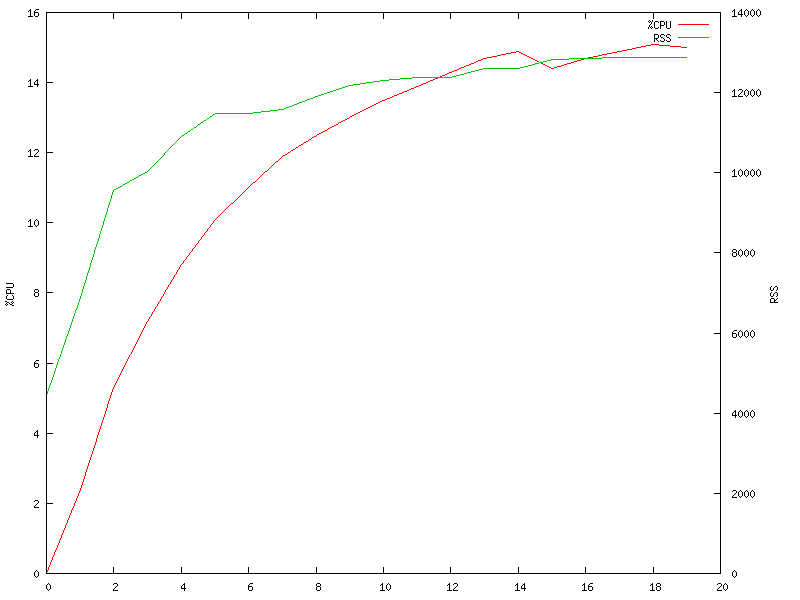
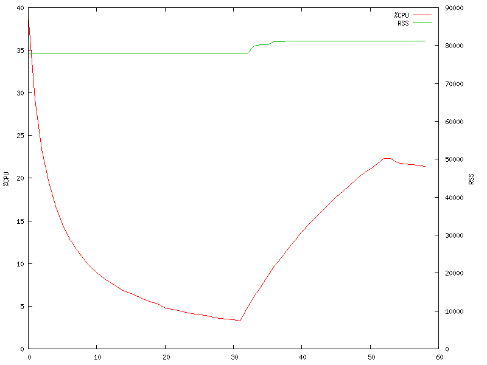
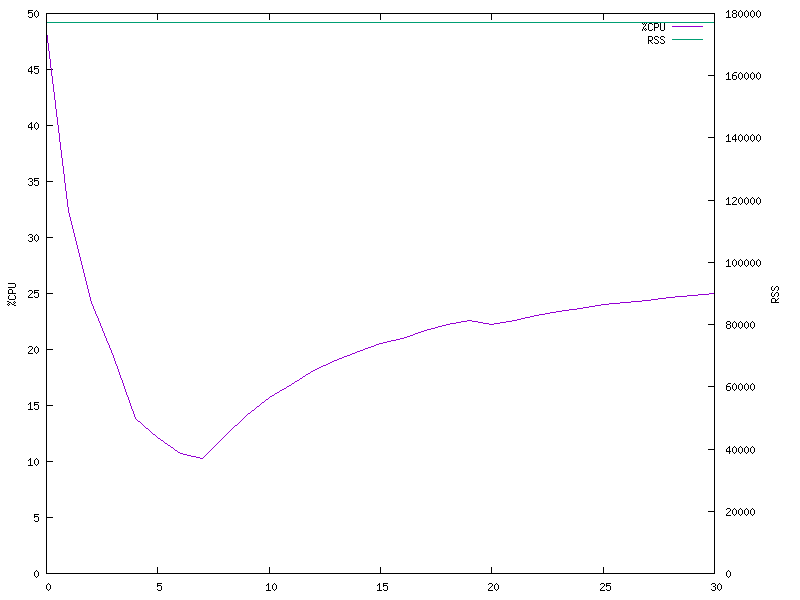

# A pragmatic comparison of lightweight VM solutions

By Daniel Trugman, 07-Mar-2022

The goal of this project is to perform a comparison between different popular LVM solutions.
Specifially focusing on the hottest discussion topics around LVMs as valid substitutes to containers (from a performance perspective only).

## Introduction

The last 15 years made it clear that the IT industry is shifting to cloud solutions.
By 2010, Amazon, Google, Microsoft had all launched cloud divisions, and by 2014, with the introduction of Kubernetes and the inception of the Cloud Native Computing Foundation (CNCF), cloud infrastructures gained incredible traction and became the go-to solution for newly emerging products.
Going forwards, market specialists from Gartner predict a very bright future: [(Source)](https://www.gartner.com/smarterwithgartner/cloud-shift-impacts-all-it-markets)

> "By 2024, more than 45% of IT spending on system infrastructure, infrastructure software, application software and business process outsourcing will shift from traditional solutions to cloud." 

Unlike managing your own servers, the transition to the cloud opened up multiple different options.
Customers can decide which parts of their systems they wanna manage on their own.
Why manage your OS, if you can just ignore that part, and manage your containers.
And why should you even manage your containers, if you can just implement a compute function (Faas)?

Those new XaaS approaches allowed cloud providers reach maximal utilization of their infrastructure, by calculating and assigning loads wherever and however they wanted, reusing containers and more.

But multi-tenancy created a myriad of other issues:
- If you run containers from different customers, how do you assure them of appropriate security boundaries?
- If you're trying to solve FaaS cold start-up issues and reuse containers, how are you going to avoid information leaks between executions?

Such issues were piling up when multiple organizations decided it's time to start considering the next step in evolution.
Organization today are considering novel technologies to create a solution that is both secure and cheap (performance and resource wise).
One of those solutions is Lightweight VMs.

### Lightweight VMs

VMs were always more secure than containers thanks for their improved isolation and a much smaller attack surface.
And they were replaced by containers mostly because they are more costly, both considering their start-up time and the amount of resources they consume.
What if only we could make them lighter?

Multiple solutions are now emerging, with the following two being the most popular ones:

#### [Firecracker](https://firecracker-microvm.github.io/)
Firecracker is a new VMM (Virtual Machine Manager) from Amazon is purpose-built for creating and managing secure, multi-tenant container and function-based services.

It is designed as a lightweight replacemnt of QEMU:
> _"Firecracker is a virtual machine monitor (VMM) that uses the Linux Kernel-based Virtual Machine (KVM) to create and manage microVMs. Firecracker has a minimalist design. It excludes unnecessary devices and guest functionality to reduce the memory footprint and attack surface area of each microVM. This improves security, decreases the startup time, and increases hardware utilization."_

Firecracker provides a virtualization environment that can be controlled via an API. Every microVM provides minimal storage, networking and rate limiting capabilities that the guest OS can use. Essentially, Firecracker is a Virtual Machine Manager like QEMU.

#### [Kata Containers](https://katacontainers.io/)
A new "container runtime" that runs each container inside a lightweight virtual machine using QEMU as their VMM.
their main goal is to keep the easy-to-use container API and wrap the containers seamlessly inside VMs.

They use a complex chain of tools to be actually able to run OCI image-spec compliant containers,
which means you don’t need to touch your existing Dockerfiles.
Kata also supports CNI, which makes it compliant to all major standards while still running the actual containers in a VM.

As every container is started inside a new VM, Kata provides an optimized base VM image to speed up boot times for them.
Commands like docker exec still need to work, so an agent inside the VM is running and monitoring the application.
The agent communicates with the kata-proxy located on the host through the hypervisor.

Latest version of Firecracker already integrate with Firecracker as their LVM. Combining the best of the two worlds, and replacing QEMU as their underlying solution.
This would mean bringing together the standardized API provided by Kata and the fast and secure Firecracker microVMs.

## Infrastructure

I am going to use a 64-bit ARM Amazon Linux 2 Server host running LVMs using a KVM as my hypervisor.
All of this is going to run on a **dedicated cloud server** hosted on AWS.
That is important for a few critical reasons:

### No share resources

If we were running on a virtualized cloud compute instance (e.g. AWS non-metal EC2), our Linux host would share the hardware with additional cloud compute instances that we can't control.
If those instances were to run varying workloads throughout our benchmarking attempts, no matter how good is the underlying hypervisor, our results could've been corrupted by our noisy neighbours.
Benchmarking should always be performed in an isolated environment, with as little variables as possible.

### One layer of virtualization

Modern CPUs from Intel, AMD and ARM implement native virtualization technologies.
Those technologies enhance the performance of guested VMs by letting the guest manage its own resources without requiring the hypervisor's intervention.
The important bit here, is that those enhancements are only available for the 1st VM running on the machine. If we were to run the VMs inside an already virtualized environment,
performance could've been significantly affected.
Since cloud providers plan on running LVMs as the first layer of virtualization, we strive to replicate their setup as closely as possible.

### Server spec:

CPUs:
```
$ lscpu
Architecture:        aarch64
Byte Order:          Little Endian
CPU(s):              16
On-line CPU(s) list: 0-15
Thread(s) per core:  1
Core(s) per socket:  4
Socket(s):           4
NUMA node(s):        1
Model:               3
BogoMIPS:            166.66
L1d cache:           32K
L1i cache:           48K
L2 cache:            2048K
NUMA node0 CPU(s):   0-15
Flags:               fp asimd evtstrm aes pmull sha1 sha2 crc32 cpuid
```

Memory:
```
$ grep "Total" /proc/meminfo
MemTotal:           32798936 kB
SwapTotal:                 0 kB
VmallocTotal:   135290159040 kB
CmaTotal:              65536 kB
HugePages_Total:           0
```

## Application

For this comparison, We're going to use simple web [client](client/) & [server](server/) application written in Go.
In an attempt to remove as many variables as possible, Golang's inherent static-compiled applications eliminate many environment-related factors.

## Baseline - Native performance

When benchmarking and comparing multiple solutions, it's critical to always have a baseline to compare to.
Before starting any benchmarks, we'll see how our application performs natively on the machine.

### Startup time

To measure the startup time, we will be using our [benchmarking tools](benchmark/) and some utility scripts from the [native benchmarking directory](native/).
Because we are running on a server with 8 CPUs, it's enough to examine bootup times of 1, 4, 8, 16 and 64 instances simultaneously.
This way we can see how the "environment" behaves when loading a single or few instances without any contention, compared to higher numbers of instances where the contention is maximized.

As a rule of thumb, we will always run 5 iterations of every scenario, allow a 5 second cooldown period between iterations, and average out the results.
We start with running the instances without any delays between consecutive executions.

We will be running the following command "loop": (`X` as delay value means - "no delay")
```
for instances in 1 4 8 16; do
  echo "==== $instances instances ===="
  ./benchmark-multiple.sh 5 5 $instances X "pkill webd" "./shim.sh"
done
```

Here are the results (Some prints were removed for brevity):
```
==== 1 instances ====
Iteration #1: On average, 4ms
Iteration #2: On average, 4ms
Iteration #3: On average, 4ms
Iteration #4: On average, 4ms
Iteration #5: On average, 4ms
==== 4 instances ====
Iteration #1: On average, 4ms
Iteration #2: On average, 4ms
Iteration #3: On average, 4ms
Iteration #4: On average, 4ms
Iteration #5: On average, 4ms
==== 8 instances ====
Iteration #1: On average, 4.625ms
Iteration #2: On average, 4.375ms
Iteration #3: On average, 4.625ms
Iteration #4: On average, 4.375ms
Iteration #5: On average, 4.25ms
==== 16 instances ====
Iteration #1: On average, 7.5625ms
Iteration #2: On average, 8.1875ms
Iteration #3: On average, 7.375ms
Iteration #4: On average, 7.375ms
Iteration #5: On average, 7ms
==== 32 instances ====
Iteration #1: On average, 8.65625ms
Iteration #2: On average, 8.40625ms
Iteration #3: On average, 8.9375ms
Iteration #4: On average, 9.0625ms
Iteration #5: On average, 9.4375ms
==== 64 instances ====
Iteration #1: On average, 8.78125ms
Iteration #2: On average, 8.6875ms
Iteration #3: On average, 10.40625ms
Iteration #4: On average, 10.375ms
Iteration #5: On average, 9.53125ms
```

We can see that executions scale very well, with an overhead of merely 100% with high contention.
However, if we yield after every instance execution (0 causes `sleep 0`, yielding execution),
we practically remove all overhead in parallel execution, even for very large instance counts:
```
$ ./benchmark-multiple.sh 5 5 128 0 "pkill webd" "./shim.sh"
Iteration #1: On average, 4.015625ms
Iteration #2: On average, 4.0234375ms
Iteration #3: On average, 4.015625ms
Iteration #4: On average, 4.03125ms
Iteration #5: On average, 4.03125ms
$ ./benchmark-multiple.sh 5 5 1024 0 "pkill webd" "./shim.sh"
Iteration #1: On average, 4.3525390625ms
Iteration #2: On average, 4.3271484375ms
Iteration #3: On average, 4.2880859375ms
Iteration #4: On average, 4.3291015625ms
Iteration #5: On average, 4.3447265625ms
```

### Idle memory consumption

This metric is interesting to see how big is the overhead for every instance running inside a non-native environment.

When running natively, every instance of the application consumes 1GB of virtual memory and less than 5MB of resident memory **when idle**:
```
VmSize:  1086920 kB
VmRSS:      4472 kB
```

### Performance

Such a minimal web client/server is going to be network bound, so there is no point in measuring the max TPS.
If we do that, we're basically going to be measuring the performance of our network stack and/or network taps.
Instead, we're going to run a relatively small load and see if there any excess CPU consumption when running in a non-native environment.

We're going to use our webclient to generate moderate traffic towards the server for 20 seconds or so.
We're going to do so through the network interface, and not localhost, so that our measurement is as close as possible to running our server inside an environment:
```
./webc http://<eth0-ip>:9090 1
```

The result is this:



We can see tha the CPU rises slowly to around 15% and the RSS to around 13MB.

## Firecracker

In order to measure boot-up time, we want to automate the process of starting a VM running our webserver.
We want to be able to run a single command on the host that will create and set up everything.

You can review all the steps under the [firecracker](firecracker/) directory.

### Startup time

To measure the startup time, we will be using our [benchmarking tools](benchmark/) and some utility scripts from our [firecracker benchmarking directory](firecracker/).
We'll examine bootup times with the same configuration we did for native executions.
Iterations: 5
Delay between iterations: 5 seconds
Instances: 1, 4, 8, 16, 64
Delay between instance executions: None

The results are:
```
==== 1 instances ====
Iteration #1: On average, 1043ms
Iteration #2: On average, 1028ms
Iteration #3: On average, 1085ms
Iteration #4: On average, 1120ms
Iteration #5: On average, 1073ms
==== 4 instances ====
Iteration #1: On average, 1148.5ms
Iteration #2: On average, 1200.5ms
Iteration #3: On average, 1134ms
Iteration #4: On average, 1152.25ms
Iteration #5: On average, 1192.75ms
==== 8 instances ====
Iteration #1: On average, 1250.5ms
Iteration #2: On average, 1312.25ms
Iteration #3: On average, 1284.125ms
Iteration #4: On average, 1267.5ms
Iteration #5: On average, 1256.5ms
==== 16 instances ====
Iteration #1: On average, 1777.875ms
Iteration #2: On average, 1785.875ms
Iteration #3: On average, 1780.3125ms
Iteration #4: On average, 1758.6875ms
Iteration #5: On average, 1726.6875ms
==== 32 instances ====
Iteration #1: On average, 4297.1875ms
Iteration #2: On average, 4144.59375ms
Iteration #3: On average, 4015.25ms
Iteration #4: On average, 3965.53125ms
Iteration #5: On average, 4273.5ms
==== 64 instances ====
Iteration #1: On average, 10476.625ms
Iteration #2: On average, 10160.234375ms
Iteration #3: On average, 10713.59375ms
Iteration #4: On average, 10512.65625ms
Iteration #5: On average, 10033.890625ms
```

We can see that the increment in start-up time is very significant when there is CPU contention.
We add delay between instance executions to see if it helps:
```
$ for delay in 0.025 0.075 0.125 0.175 0.25 0.5; do echo "==== Delay = $delay[s] ===="; ./benchmark-multiple.sh 5 5 64 $delay "pkill firecracker" "./shim.sh"; done
==== Delay = 0.025[s] ====
Iteration #1: On average, 6952.515625ms
Iteration #2: On average, 6581.375ms
Iteration #3: On average, 6713.84375ms
Iteration #4: On average, 6593.21875ms
Iteration #5: On average, 7023.78125ms
==== Delay = 0.075[s] ====
Iteration #1: On average, 2762.109375ms
Iteration #2: On average, 3006.0625ms
Iteration #3: On average, 2986.59375ms
Iteration #4: On average, 3068.765625ms
Iteration #5: On average, 2907.328125ms
==== Delay = 0.125[s] ====
Iteration #1: On average, 1250.75ms
Iteration #2: On average, 1269.65625ms
Iteration #3: On average, 1258.46875ms
Iteration #4: On average, 1264.625ms
Iteration #5: On average, 1257.6875ms
==== Delay = 0.175[s] ====
Iteration #1: On average, 1107.140625ms
Iteration #2: On average, 1112.796875ms
Iteration #3: On average, 1116.53125ms
Iteration #4: On average, 1117.234375ms
Iteration #5: On average, 1116.21875ms
==== Delay = 0.25[s] ====
Iteration #1: On average, 1062.1875ms
Iteration #2: On average, 1063.296875ms
Iteration #3: On average, 1064.53125ms
Iteration #4: On average, 1067.578125ms
Iteration #5: On average, 1066.484375ms
==== Delay = 0.5[s] ====
Iteration #1: On average, 1037.96875ms
Iteration #2: On average, 1040.5625ms
Iteration #3: On average, 1042.109375ms
Iteration #4: On average, 1037.484375ms
Iteration #5: On average, 1046.40625ms
```

We can see that delays help up to about 0.175-0.25 seconds.
Because the execution time of a single instance is around 1.1 seconds, and there are 8 CPUs,
Adding this delay, is pretty much the amount of time we need to wait for have exact 8 instances executing at any given time (considering we have client running on the machine as well).
Since our web application is network bound, and it sleeps when there are no incoming traffic, it makes perfect sense.

**Bottom line, correctly planned, a firecracker instance takes around a second to execute.**

Note about taps: Even if we pre-prepare a network tap and not account for that, the execution time of a single instance stays almost the same (above 1 second),
and the effect on running multiple instances is the same as adding a bit more delay (64 instances, 0.175s delay -> On average, 1027.921875ms).

### Idle memory consumption

First, by looking at the process tree (`pstree -p`), we can see Firecracker executes a single process for every running VM:

```
           `-tmux(7275)---bash(24961)---run-firecracker(2370)---firecracker(2386)-+-{firecracker}(2387)
                                                                                  `-{firecracker}(2389)
```

And the memory consumption for the process **when idle** is:
```
VmSize:   137596 kB
VmRSS:     75936 kB
```

The virtual memory is clearly a direct result of our configuration options (see configuration file under [firecracker](firecracker/README.md)):
```
"mem_size_mib": 128
```

The resident memory is interesting. We know our application consumes less than 5MB of resident memory, so the minimal overhead of a Firecracker VM is **around 70MB**.

### Performance

Just like we did for the native application, we're going to measure CPU & RSS memory consumption given moderate traffic using our web client.
We're going to do so through the tap interface:
```
./webc http://169.254.0.1:9090 1
```

The result is this:



What's interesting here, is that we can see the initial CPU usage when starting up the VM.
The CPU then lowers, but never reaches 0%, because the VM is never completely idle (stabilizes at around 4-5% in idle state).
We then start to generate traffic and the CPU rises slowly to around 22% and the RSS to around 81MB.

As we can see, there's a clear CPU overhead to running inside a VM, but the RSS increases at approximately the same amount under stress.

## Kata Containers

Kata Containers is an OpenStack project.

To make sure we're comparing apples to apples, we will create a new container for our benchmark.
The container will be based on the latest alpine linux image with our statically compiled `webd` binary.

You can read the full explanation about the setup inside the [kata directory](kata/).

### Startup time

To measure the startup time, we will be using our [benchmarking tools](benchmark/) and some utility scripts from our [kata benchmarking directory](firecracker/).
We'll examine bootup times with the same configuration we did before.
Iterations: 5
Delay between iterations: 5 seconds
Instances: 1, 4, 8, 16, 64
Delay between instance executions: None

The results are:
```
==== 1 instances ====
Iteration #1: On average, 1605ms
Iteration #2: On average, 1610ms
Iteration #3: On average, 1576ms
Iteration #4: On average, 1566ms
Iteration #5: On average, 1601ms
==== 4 instances ====
Iteration #1: On average, 2345.75ms
Iteration #2: On average, 2373.25ms
Iteration #3: On average, 3029.25ms
Iteration #4: On average, 3292.25ms
Iteration #5: On average, 2325ms
==== 8 instances ====
Iteration #1: On average, 3634ms
Iteration #2: On average, 3773ms
Iteration #3: On average, 3354.5ms
Iteration #4: On average, 3354.125ms
Iteration #5: On average, 3332.5ms
==== 16 instances ====
Iteration #1: On average, 6045.0625ms
Iteration #2: On average, 5155.25ms
Iteration #3: On average, 5128.8125ms
Iteration #4: On average, 4673.9375ms
Iteration #5: On average, 4826ms
==== 64 instances ====
Iteration #1: On average, 7769.125ms
Iteration #2: On average, 8321.6875ms
Iteration #3: On average, 8243ms
Iteration #4: On average, 8017.5625ms
Iteration #5: On average, 9349.40625ms
```

We can see that the increment in start-up time is very significant when there is CPU contention.
We add delay between instance executions to see if it helps (We start with higher values based on the results, as smaller delays probably won't help much):
```
$ for delay in 0.125 0.175 0.25 0.5 1.5; do echo "==== Delay = $delay[s] ===="; ./benchmark-multiple.sh 5 5 64 $delay "./cleanup.sh" "./shim.sh"; done
==== Delay = 0.125[s] ====
Iteration #1: On average, 8064.625ms
Iteration #2: On average, 6404.5ms
Iteration #3: On average, 6392.09375ms
Iteration #4: On average, 6101.96875ms
Iteration #5: On average, 6816.21875ms
==== Delay = 0.175[s] ====
Iteration #1: On average, 5429.09375ms
Iteration #2: On average, 5599.6875ms
Iteration #3: On average, 5361.3125ms
Iteration #4: On average, 5452.875ms
Iteration #5: On average, 5566.3125ms
==== Delay = 0.25[s] ====
Iteration #1: On average, 4509.59375ms
Iteration #2: On average, 4580.46875ms
Iteration #3: On average, 4441.4375ms
Iteration #4: On average, 4367.375ms
Iteration #5: On average, 4245.875ms
==== Delay = 0.5[s] ====
Iteration #1: On average, 2584.9375ms
Iteration #2: On average, 2486.84375ms
Iteration #3: On average, 2607.40625ms
Iteration #4: On average, 2701.84375ms
Iteration #5: On average, 2536.875ms
==== Delay = 1.5[s] ====
Iteration #1: On average, 2237.078125ms
Iteration #2: On average, 2067.421875ms
Iteration #3: On average, 2040.3125ms
Iteration #4: On average, 2048.40625ms
Iteration #5: On average, 2052.21875ms
```

We can see that even with significant delay, Firecracker performs much better.
And considering delays of 1.5s are not really practical, in real-life scenarios, this is going to be a big issue.

### Idle memory consumption

First, by looking at the process (`ps aux | grep kata`), we can see Kata executes multiple processes (full command lines trimmed for clarity):
```
ubuntu     24340  0.0  0.1 2231088 46616 pts/1   Sl+  01:57   0:00 docker run --runtime kata webd:latest
root       16902  0.1  0.2 2325632 73224 ?       Ssl  01:45   0:01 /usr/bin/dockerd [...]
root        3146  0.0  0.1 2367932 38400 ?       Ssl  01:28   0:01 /usr/bin/containerd
root       24373  0.0  0.0 710800  8152 ?        Sl   01:57   0:00 /usr/bin/containerd-shim-runc-v2 [...]
root       24446  0.5  0.5 2644380 177264 ?      Sl   01:57   0:01 /snap/kata-containers/686/usr/bin/qemu-system-aarch64 [...]
root       24452  0.0  0.0 920008  3852 ?        Ssl  01:57   0:00 /snap/kata-containers/686/usr/libexec/kata-containers/kata-proxy [...]
root       24475  0.0  0.0 784736 15484 pts/3    Ssl+ 01:57   0:00 /snap/kata-containers/686/usr/libexec/kata-containers/kata-shim [...]
```

We can see that the overhead of the "environment" for a single application is very significant.
Using smem we can find out the real consumption of all those processes:
```
  PID User     Command                         Swap      USS      PSS      RSS
24340 ubuntu   docker run --runtime kata w        0    46956    47188    48348
16902 root     /usr/bin/dockerd -H fd:// -        0    72552    72683    75172
 3146 root     /usr/bin/containerd                0    39032    39058    39996
24373 root     /usr/bin/containerd-shim-ru        0     9640     9640     9644
24446 root     /snap/kata-containers/686/u        0   177384   177384   177388
24452 root     /snap/kata-containers/686/u        0     4912     5065     5948
24475 root     /snap/kata-containers/686/u        0    15932    16082    16960
```

We can see that the true total memory consumption of those processes is around 365MB (RSS).
We're calling that the true consumption, because no resident memory is shared between those processes using COW,
hence their [PSS](https://www.kernel.org/doc/html/latest/filesystems/proc.html?highlight=Pss#:) is equal to their RSS.

This is an **overhead of 360MB for a single instance** of our application.

But that's not a good measurement. On a real-life environment, we are going to run multiple containers, and some of those binaries are daemons that server them all.
Let's run an additional instance of our app and try to find the real overhead per instance:
```
  PID User     Command                         Swap      USS      PSS      RSS
25701 ubuntu   docker run --runtime kata w        0    17500    32337    48144
24340 ubuntu   docker run --runtime kata w        0    17696    32536    48360
16902 root     /usr/bin/dockerd -H fd:// -        0    73032    73165    75652
 3146 root     /usr/bin/containerd                0    39376    39402    40340
25735 root     /usr/bin/containerd-shim-ru        0     2412     5882     9356
24373 root     /usr/bin/containerd-shim-ru        0     2708     6178     9652
25814 root     /snap/kata-containers/686/u        0     2468     3628     5560
24452 root     /snap/kata-containers/686/u        0     3156     4322     6276
25837 root     /snap/kata-containers/686/u        0     7260    11701    16924
24475 root     /snap/kata-containers/686/u        0     7288    11732    16960
25808 root     /snap/kata-containers/686/u        0   170940   174152   177368
24446 root     /snap/kata-containers/686/u        0   170960   174172   177388
```

Note: Since the executables are now sharing binaries, we can see some of the PSS values are lower than the RSS (but not significantly).

We can see that by running an additional instance, we get four new processes: (PSS memory in parenthesis)
docker (32MB) + containerd-shim-runc (6MB) + qemu (174MB) + kata-proxy (4MB) + kata-shim (11MB)

In total, an overhead of ~225MB for a single instance! Much more than Firecracker.

### Performance

Just like we did for before, we're going to measure CPU & RSS memory consumption given moderate traffic using our web client.
We're going to do so through the tap interface:
```
./webc http://169.254.0.1:9090 1
```

The result is this:



Here, just like with Firecracker, we can see the initial CPU usage when starting up the VM.
The CPU lowers to about 10%, because we don't wait for too long, and because it's never idle.
We then start to generate traffic and the CPU rises slowly to around 25%.
The memory however, doesn't really change, RSS values are around 180MB the whole time (Considering only QEMU that contains our process).

## Conclusions

In terms of performance, it is clear the Firecracker has the upper hand.
However, in terms of usability, Kata's integration with the OCI is a huge advantage.
It is no surprise that the combination of both, where Kata provides the OCI integration and uses Firecracker instead of QEMU can be a winning combination.